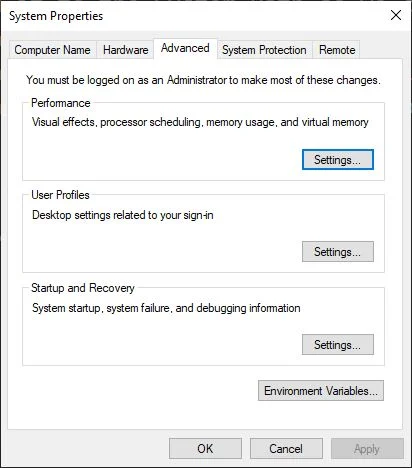
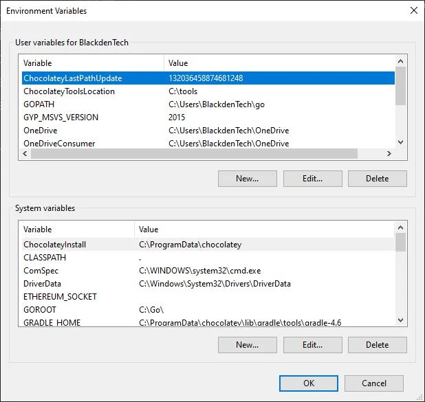
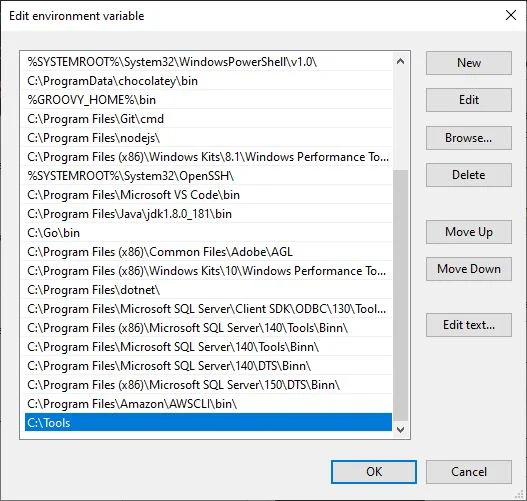

# qterraform

Github repository
Terraform Resources and Code Git Location: ([https://github.com/anshulc55/terraform])
<------------------------------------------------------------------------------->
## Install Terraform

### Install Terraform on Mac Machine -

To Install the Terraform on MAC Machine, just copy-paste the below script in your local Machine and execute this script. Or you can execute the given commands in Script one by one but complete script execution is preferred over single line Command Execution.

mac-terraform-install.sh

```shell
brew install jq
brew install wget
cd ~
version=$(curl https://api.github.com/repos/hashicorp/terraform/releases/latest --silent | jq ".tag_name" -r)
version=$(echo $version | sed 's/v//g') # get rid of 'v' from version number
echo "Installing Terraform $version."
url="https://releases.hashicorp.com/terraform/$version/terraform_$(echo $version)_darwin_amd64.zip"
wget $url
unzip "terraform_$(echo $version)_darwin_amd64.zip"
chmod +x terraform
sudo mv terraform /usr/local/bin/
echo "Terraform $version installed."
rm "terraform_$(echo $version)_darwin_amd64.zip"
echo "Install files cleaned up."
```

### Install Terraform on Windows 10 -

1. Download the appropriate version of Terraform from HashiCorp’s download page. In my case, it’s the Windows 64-bit version.
2. Make a folder on your C:\ drive where you can put the Terraform executable. I prefer to place installers in a subfolder (e.g. C:\tools) where you can put binaries.
3. After the download finishes, go find it in File Explorer. Extract the zip file to the folder you created in step 2.
4. Open your Start Menu and type in “environment” and the first thing that comes up should be Edit the System Environment Variables option. Click on that and you should see this window.

5. Click on Environment Variables… at the bottom and you’ll see this:

6. Under the bottom section where it says System Variables, find one called Path and click edit. You’ll then see a list of where to find the binaries that Windows might need for any given reason.
7. Click New and add the folder path where terraform.exe is located to the bottom of the list. It should look like this when you finish.

8. Click OK on each of the menus you’ve opened up until there’s no more left.
9. To make sure that Windows detects the new path, open a new CMD/PowerShell prompt and enter refreshenv. or close the opened PowerShell window and Open New One.
10. Verify the installation was successful by entering terraform --version. If it returns a version, you’re good to go.
<!------------------------------------------------------------------------------->

<------------------------------------------------------------------------------->
## Run Terraform

```shell
# Initilize Terraform
terraform init
# Format Terraform code
terraform fmt
# Validate Terraform Code
terraform validate
```

```shell
# start Terraform Plan
terraform plan
```
```shell
# Start Terraform Plan & export output
terraform plan -out=plan.out
# Show Terraform plan.out File
terraform show plan.out
# Convert plan.out to plan.json
terraform show -json plan.out > plan.json
# Export Specific Resource from plan.json File
jq '.resource_changes[].address' plan.json
```

```shell
# Apply Terraform code
terraform apply
# Apply Terraform plan.out File
terraform apply plan.out
# Apply Terraform code with Auto Approve
terraform apply -auto-approve
```

```shell
# Show Terraform Output
terraform output
```

```shell
# Destroy Terraform code
terraform destroy -auto-approve
```

```shell
# Plan Terraform Workspace for Specific Environment
terraform workspace $WORKSPACE $ENV
# Select Terraform Workspace Environment
terraform workspace select $ENV
terraform apply
```
<!------------------------------------------------------------------------------->
```shell
grep -R "resource \"aws_lb\"" .
grep -R "resource \"aws_lb_target_group\"" .
grep -R "resource \"aws_ecs_service\"" .
```
<------------------------------------------------------------------------------->
## Terraform Info

```shell
terraform init
terraform fmt
terraform validate
terraform plan
```

```shell
terraform force-unlock be956125-f279-13fd-6a2f-594d623df862
```
```shell
terraform apply
```
```shell
ls -a
rm .terraform.tfstate.lock.info
```
```shell
terraform destroy -target=module.eks
```
```shell
terraform state list
terraform plan
terraform apply --auto-approve
terraform apply -lock=false
```

## ✅ Recommended: S3 Remote Backend (with DynamoDB locking)

### 1️⃣ Create S3 bucket (one time)
```shell
aws s3api create-bucket --bucket terraform-state-bucket-qasem --region $AWS_REGION
  ```
> Enable versioning (strongly recommended):
```shell
aws s3api put-bucket-versioning --bucket terraform-state-bucket-qasem --versioning-configuration Status=Enabled
```

### 2️⃣ (Optional but best practice) Create DynamoDB table for locking
```shell
aws dynamodb create-table \
  --table-name terraform-locks \
  --attribute-definitions AttributeName=LockID,AttributeType=S \
  --key-schema AttributeName=LockID,KeyType=HASH \
  --billing-mode PAY_PER_REQUEST
```
```json
{
    "TableDescription": {
        "AttributeDefinitions": [
            {
                "AttributeName": "LockID",
                "AttributeType": "S"
            }
        ],
        "TableName": "terraform-locks",
        "KeySchema": [
            {
                "AttributeName": "LockID",
                "KeyType": "HASH"
            }
        ],
        "TableStatus": "CREATING",
        "CreationDateTime": "2025-12-16T14:43:44.517000+03:00",
        "ProvisionedThroughput": {
            "NumberOfDecreasesToday": 0,
            "ReadCapacityUnits": 0,
            "WriteCapacityUnits": 0
        },
        "TableSizeBytes": 0,
        "ItemCount": 0,
        "TableArn": "arn:aws:dynamodb:eu-central-1:907244240513:table/terraform-locks",
        "TableId": "085d86a2-e2f7-462a-ac46-ecb7b959a111",
        "BillingModeSummary": {
            "BillingMode": "PAY_PER_REQUEST"
        },
        "DeletionProtectionEnabled": false
    }
}
```

### 3️⃣ Configure Terraform backend
Add this to backend.tf (or inside terraform {}):
```json
terraform {
  backend "s3" {
    bucket         = "terraform-state-bucket-qasem"
    key            = "eks/terraform.tfstate"
    region         = "us-east-1"
    encrypt        = true
    dynamodb_table = "terraform-locks"
  }
}
```
📌 After this:
* Terraform writes state to S3
* State is updated after every apply
* DynamoDB prevents concurrent applies
* S3 versioning gives rollback safety

### 4️⃣ Initialize backend
```shell
terraform init
```

### 🔁 What happens after this?
__Every time you run:__
```shell
terraform apply
```
__Terraform will:__
* Lock state in DynamoDB
* Apply changes
* Upload updated terraform.tfstate to S3
* Release lock

### ✅ No manual upload needed.
🔒 IAM permissions required
The IAM role/user running Terraform must have:
```json
{
  "Effect": "Allow",
  "Action": [
    "s3:GetObject",
    "s3:PutObject",
    "s3:ListBucket"
  ],
  "Resource": [
    "arn:aws:s3:::my-terraform-state-bucket",
    "arn:aws:s3:::my-terraform-state-bucket/*"
  ]
}
```
Plus DynamoDB permissions if locking is enabled.

### 🧪 Verify state is in S3
```shell
aws s3 ls s3://terraform-state-bucket-qasem/eks/
```
🚫 Common mistakes to avoid
❌ Using local backend + scripts
❌ Committing terraform.tfstate to Git
❌ Sharing state files without locking
❌ Using the same state file for multiple environments

🟢 Bonus: Separate state per environment
key = "eks/${terraform.workspace}/terraform.tfstate"

❌ Case 1: Local state (no remote backend)
__Worst case__
What happens:
1. Both users run terraform apply
2. Each has their own local terraform.tfstate
3. Terraform has no idea the other apply exists

__Result:__
Resources get created/modified twice
1. State files diverge
2. Future applies cause deletes, recreates, or drift
3. Manual recovery required

⚠️ This is how infrastructures get corrupted.
⚠️ Case 2: Remote state without locking

Example: S3 backend without DynamoDB

> What happens:
User A reads state
User B reads same state
Both apply changes
Last writer wins

> Result:
State file overwritten
Lost updates
Infrastructure may be partially updated
Terraform might destroy resources unexpectedly later

✅ Case 3: Remote state with locking (Best practice)

> Example: S3 + DynamoDB
What happens:
1. User A runs terraform apply
2. Terraform acquires a lock in DynamoDB
3. User B runs terraform apply
4. User B is blocked
5. User B sees:

Error acquiring the state lock
Lock Info:
  ID:        xxxxx
  Operation: OperationTypeApply
  Who:       userA@hostname


> Result:
* Only one apply runs at a time
* State remains consistent
* No corruption
* User B must wait or retry

🧠 Important details
__What if User A crashes?__
1. Lock remains
2. User B cannot apply
3. Fix (safe):
```shell
terraform force-unlock <LOCK_ID>
```

__What about terraform plan?__
1. Multiple users can run plan safely
2. plan does not lock state (read-only)
```yaml
🔒 Recommended setup (must-have)
terraform {
  backend "s3" {
    bucket         = "my-tf-state"
    key            = "prod/terraform.tfstate"
    region         = "us-east-1"
    dynamodb_table = "terraform-locks"
    encrypt        = true
  }
}
```
__🚨 What NOT to do__
❌ Run Terraform from multiple laptops
❌ Share state without locking
❌ Manually edit state files
❌ Run applies outside CI/CD

__✅ Best practice in teams__
1. Single CI/CD pipeline runs terraform apply
2. Developers run terraform plan only
3. Locking enabled
4. State stored remotely

__🟢 Summary__
Setup	Outcome
Local state	💥 Corruption
Remote no lock	⚠️ Lost updates
Remote + lock

<!------------------------------------------------------------------------------->
